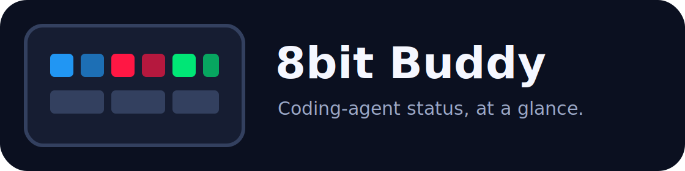
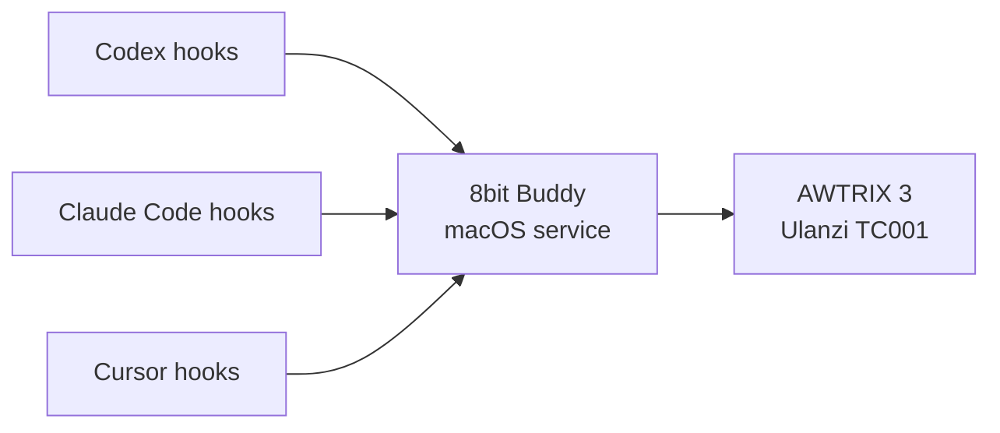

<p align="center">
  
</p>

<p align="center">
  Physical status for Codex, Claude Code, and Cursor agents.
</p>

<p align="center">
  <a href="https://github.com/cyberaidev/8bit-buddy/actions/workflows/ci.yml"></a>
  <a href="LICENSE"></a>
  
  
</p>

8bit Buddy turns a small RGB LED display into a glanceable control plane for local coding
agents. Each active agent gets its own rotating page with the provider, agent or workspace name,
and current state.

| State | Display | Meaning |
| --- | --- | --- |
| Working | Blue | The agent is processing a prompt or a subagent is active |
| Needs you | Flashing red | Permission, clarification, selection, or another input is required |
| Done | Green | The turn or subagent completed normally |
| Error | Flashing red | The agent stopped with an error or was aborted |

## Recommended display

Use the [Ulanzi TC001 Smart Pixel Clock](https://www.ulanzi.com/en-au/products/ulanzi-pixel-smart-clock-2882)
with [AWTRIX 3](https://github.com/Blueforcer/awtrix3). It is the closest off-the-shelf match
for this project:

- 200.6 × 70.3 × 31.9 mm—almost exactly 20 cm wide
- 32 × 8 full-colour matrix with 256 individually addressable LEDs
- ESP32, Wi-Fi, USB-C power, and a 4,400 mAh backup battery
- Open-source AWTRIX firmware with a documented local HTTP API
- No HDMI cable and no cloud service between the Mac and the display

The Australian Ulanzi storefront listed it from about A$68 when this project was created. Prices
and availability change. See [Hardware and flashing](docs/hardware.md) before purchasing.

## How it works



Hooks send small lifecycle events to a loopback-only service on the Mac. The service normalises
the three hook formats, tracks concurrent main agents and subagents, and creates one AWTRIX custom
app per agent. AWTRIX rotates the pages automatically.

No prompt text, transcript, or status history is persisted. The service keeps only current state
and the most recent final message in memory, solely to distinguish “done” from a direct request for
input.

## macOS quick start

### 1. Prepare the display

Flash AWTRIX 3, join the display to the same reachable network as the Mac, and note its IP address.
The [hardware guide](docs/hardware.md) has the exact sequence.

### 2. Install 8bit Buddy

Python 3.11 or newer is required. `pipx` keeps the app isolated:

```bash
brew install pipx
pipx ensurepath
pipx install git+https://github.com/cyberaidev/8bit-buddy.git
```

Open a new terminal after `pipx ensurepath` if `8bit-buddy` is not found.

### 3. Configure the AWTRIX address

```bash
8bit-buddy configure --display-host 192.168.1.5
```

This repository is preconfigured for the TC001 at `192.168.1.5`. If its address changes, rerun the
command with the new IP or local hostname. The configuration is stored with mode `0600` at
`~/.config/8bit-buddy/config.toml` and includes a random local API token.

### 4. Install hooks and the background service

```bash
8bit-buddy install-hooks
8bit-buddy install-service
```

The hook installer is additive and idempotent. It creates timestamped backups, preserves existing
hooks, and adds only 8bit Buddy handlers to:

- `~/.codex/hooks.json`
- `~/.claude/settings.json`
- `~/.cursor/hooks.json`

Codex requires one extra trust step: start Codex, enter `/hooks`, review the commands, and trust
them. Cursor reloads hook configuration automatically.

### 5. Test the colours

```bash
8bit-buddy health
8bit-buddy demo
8bit-buddy status
```

`demo` shows blue, flashing red, then green. You can test without hardware first:

```bash
8bit-buddy configure --console
8bit-buddy serve
```

## Agent names and concurrent work

Main agents are named from the provider and workspace, such as `Codex · checkout`. Subagents use
their reported type, such as `Claude · Explore` or `Cursor · generalPurpose`. Every agent has a
stable AWTRIX page, so several Codex, Claude Code, and Cursor sessions can run concurrently without
overwriting each other.

Override a hook's display name manually when testing:

```bash
printf '%s' '{"hook_event_name":"Stop","session_id":"demo","cwd":"/tmp/demo"}' \
  | 8bit-buddy hook codex --name "API migration"
```

## Useful commands

```text
8bit-buddy configure          Create config with an AWTRIX address
8bit-buddy serve              Run in the foreground
8bit-buddy install-service    Install/start the macOS LaunchAgent
8bit-buddy install-hooks      Merge Codex, Claude, and Cursor hooks
8bit-buddy status             List current agents
8bit-buddy health             Check the local service and display
8bit-buddy demo               Cycle through the three primary states
8bit-buddy emit               Send a manual state
8bit-buddy uninstall-hooks    Remove only 8bit Buddy hook handlers
8bit-buddy uninstall-service  Stop/remove the macOS LaunchAgent
```

## Detection notes

The project prefers explicit lifecycle signals over transcript scraping:

- Codex: `UserPromptSubmit`, `PermissionRequest`, `SubagentStart`, `SubagentStop`, and `Stop`
- Claude Code: the same lifecycle plus `Notification` and `StopFailure`
- Cursor: `beforeSubmitPrompt`, `subagentStart`, `subagentStop`, `afterAgentResponse`, and `stop`

Claude Code exposes notification types for permission prompts and background agents. Codex exposes
permission requests directly. Cursor's current hook API does not expose a dedicated permission-dialog
event, so Cursor turns red for errors or a conservative explicit-input request in its final response.
The detector intentionally does not mark generic phrases such as “let me know if you want more” red.

See [Hook integration details](docs/hooks.md) for payloads, limitations, and links to each vendor's
official documentation.

## Security model

- The service binds to `127.0.0.1` by default.
- Hooks authenticate with a randomly generated token.
- Hook failures are fail-open and never block an agent.
- AWTRIX traffic stays on the local network and uses its local HTTP API.
- The service never reads agent transcript files.
- Existing hook files are backed up before changes.

Do not expose port `7391` to another network. Segment untrusted IoT devices and restrict lateral
access according to your own network policy.

## Development

```bash
git clone https://github.com/cyberaidev/8bit-buddy.git
cd 8bit-buddy
python3 -m venv .venv
source .venv/bin/activate
python -m pip install -e .
python -m unittest discover -s tests -v
```

Read [CONTRIBUTING.md](CONTRIBUTING.md) before opening a pull request. 8bit Buddy is independent
open-source software and is not affiliated with OpenAI, Anthropic, Cursor, Ulanzi, or AWTRIX.

## License

[MIT](LICENSE)
